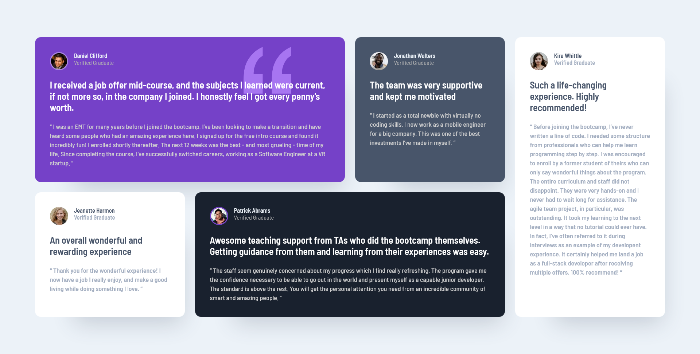

# Frontend Mentor - Testimonials grid section solution

This is a solution to the [Testimonials grid section challenge on Frontend Mentor](https://www.frontendmentor.io/challenges/testimonials-grid-section-Nnw6J7Un7). Frontend Mentor challenges help you improve your coding skills by building realistic projects. 

Users should be able to:

- View the optimal layout for the site depending on their device's screen size

- [Solution](https://www.frontendmentor.io/solutions/testimonials-grid-section---html-css-ySXoZ7cvvp)
- [Live Site](https://lspacka.github.io/FEM-testimonials-grid-section/)

### Built with

- HTML
- CSS